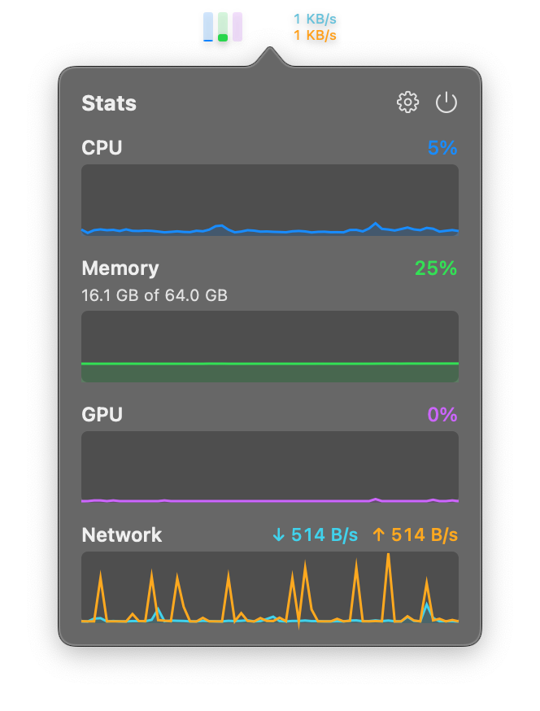

# StatsMenu

A tiny macOS menu bar system monitor. I wanted something simpler and far lighter
on resources than iStat Menus — no bloat, no Electron, just a small native app
that shows CPU / Memory / GPU and network at a glance.




- Native Swift + AppKit, zero third-party dependencies
- ~0.3% CPU idle, ~12 MB RAM
- Menu bar: CPU / Memory / GPU bars + live network ↓/↑
- Click for graphs; hover a metric for its top processes (with app icons)

## Build

Requires macOS 13+ and the Xcode command line tools.

```sh
./build.sh          # builds a release binary and packages StatsMenu.app
open StatsMenu.app
```

That's it — `StatsMenu.app` is a self-contained menu bar app (no dock icon).

To run without packaging:

```sh
swift run -c release
```
